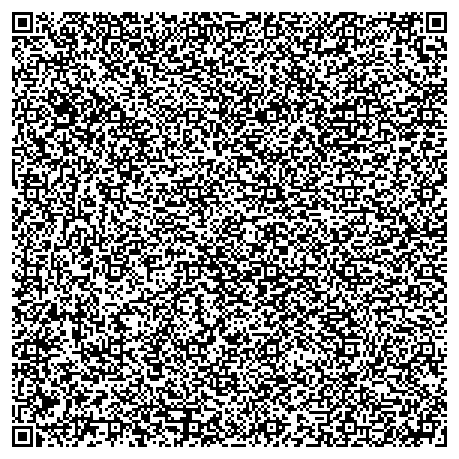

# Kodo

Esperanto for *code*

A game inside a qr code! Just scan and open the link (or copy-paste it) and you can play this amazing game!

The entire game is contained in a single `data:text/html` URL, which mostly kinda sortof sometimes works on a few moderately modern web browsers. You'll probably need to copy paste the URL manually (because SeCUrItY) but it works :D

## Game instructions

The goal is simple: get as many points as you can! You can earn points every time an enemy block falls off the screen (+1) and if you grab a coin (+5). Just move around using the arrow keys, your mouse, or touch controls. If you touch an enemy block, it's game over, and your final score is whatever you managed to gain up before that happened. It's quite straightforward.

## Roadmap

- [x] mobile support using touch events
- [x] online highscore using the JS `fetch` API
- [x] increase block speed by the square root of the score
- [ ] make the enemies triangles
- [ ] make the player a balloon
